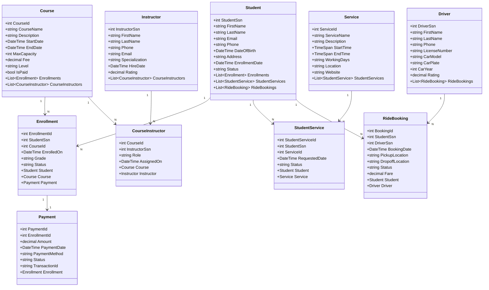

# UML Class Documentation — Student Management System

## Overview

This document describes the UML class model derived from the database schema. It is intended for backend (.NET Web API) and frontend (React) developers to understand the domain model, properties, and relationships between domain objects.

---

## Class Diagrams (Mermaid Syntax)

---

## Class Descriptions

### Student
Represents the core domain entity. Acts as the central hub linking to enrollments, service requests, and ride bookings.

- **Navigation properties:** `Enrollments`, `StudentServices`, `RideBookings`
- **Status values:** `Active`, `Inactive`, `Graduated`, `Suspended`

---

### Enrollment
Bridges a `Student` to a `Course`. Tracks academic progress and payment state.

- **Navigation properties:** `Student`, `Course`, `Payment`
- **Status values:** `Active`, `Completed`, `Withdrawn`, `Failed`
- **Business rule:** Each enrollment must have exactly one associated `Payment`.

---

### Payment
Records the financial transaction for a single enrollment. One-to-one with `Enrollment`.

- **Navigation properties:** `Enrollment`
- **Status values:** `Pending`, `Paid`, `Failed`, `Refunded`
- **Business rule:** `EnrollmentId` must be unique.

---

### Course
Describes an academic or training program. Can be assigned multiple instructors.

- **Navigation properties:** `Enrollments`, `CourseInstructors`
- **Level values:** `Beginner`, `Intermediate`, `Advanced`
- **Business rule:** `MaxCapacity` limits the number of active enrollments.

---

### Instructor
A teaching professional assigned to one or more courses.

- **Navigation properties:** `CourseInstructors`
- **Business rule:** `Rating` is between 0.00 and 5.00.

---

### CourseInstructor *(Junction)*
Resolves the many-to-many between `Course` and `Instructor`.

- **Composite PK:** `(CourseId, InstructorSsn)`
- **Role values:** `Lead`, `Assistant`, `Guest`

---

### Service
An administrative or support service accessible to students (e.g., counseling, IT helpdesk, library).

- **Navigation properties:** `StudentServices`
- **Working days format:** Comma-separated abbreviations, e.g., `"Mon,Tue,Wed"`

---

### StudentService *(Junction)*
Resolves the many-to-many between `Student` and `Service`. Tracks request lifecycle.

- **Status values:** `Pending`, `Approved`, `Rejected`, `Completed`

---

### Driver
A transportation provider associated with ride bookings.

- **Navigation properties:** `RideBookings`
- **Business rule:** `Rating` is between 0.00 and 5.00.

---

### RideBooking
Records a single transport request from a student to a driver.

- **Navigation properties:** `Student`, `Driver`
- **Status values:** `Pending`, `Confirmed`, `InProgress`, `Completed`, `Cancelled`

---

## .NET Implementation Notes

- Use **EF Core** with `DbContext` for ORM mapping.
- Composite PKs (`CourseInstructor`) use `HasKey(e => new { e.CourseId, e.InstructorSsn })` in Fluent API.
- Use **Data Annotations** or **Fluent API** for constraints (e.g., `[MaxLength]`, `IsRequired()`).
- `BOOLEAN` → `bool` / `BIT` in MSSQL via EF.
- `TEXT` → `string` mapped to `NVARCHAR(MAX)`.
- Navigation properties should be `virtual` if lazy loading is enabled.
- DTOs (Data Transfer Objects) should be created separately from domain entities to avoid over-posting.
